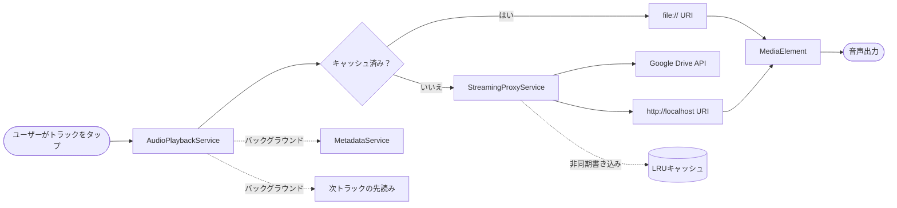

# Cloud Music Player - アーキテクチャ

## 概要

Cloud Music Player は、.NET MAUI で構築されたクロスプラットフォーム音楽プレーヤーです。Google Drive から音声ファイルをストリーミング再生し、ローカルにキャッシュします。対象プラットフォームは Android、iOS、Windows です。

**ターゲットフレームワーク:** .NET 9.0 (`net9.0-android`, `net9.0-ios`, `net9.0-windows10.0.19041.0`)

## システムアーキテクチャ図

```mermaid
graph TB
    subgraph UI["UI層 (Views / XAML)"]
        Login[LoginPage]
        FolderBrowser[FolderBrowserPage]
        Library[LibraryPage]
        NowPlaying[NowPlayingPage]
        Search[SearchPage]
        Playlists[PlaylistsPage]
        PlaylistDetail[PlaylistDetailPage]
        Equalizer[EqualizerPage]
        Settings[SettingsPage]
        MiniPlayer[MiniPlayerControl]
    end

    subgraph VM["ViewModel層 (CommunityToolkit.Mvvm)"]
        LoginVM[LoginViewModel]
        FolderBrowserVM[FolderBrowserViewModel]
        LibraryVM[LibraryViewModel]
        NowPlayingVM[NowPlayingViewModel]
        SearchVM[SearchViewModel]
        PlaylistsVM[PlaylistsViewModel]
        PlaylistDetailVM[PlaylistDetailViewModel]
        EqualizerVM[EqualizerViewModel]
        SettingsVM[SettingsViewModel]
    end

    subgraph Services["サービス層 (DI経由のシングルトン)"]
        AuthSvc[GoogleAuthService]
        DriveSvc[GoogleDriveService]
        PlaybackSvc[AudioPlaybackService]
        ProxySvc[StreamingProxyService]
        CacheSvc[CacheService]
        MetaSvc[MetadataService]
        DbSvc[DatabaseService]
        PlaylistSvc[PlaylistService]
        FavSvc[FavoritesService]
        SearchSvc[SearchService]
        EqSvc[IEqualizerService]
    end

    subgraph Platform["プラットフォーム層"]
        AndroidEq[AndroidEqualizerService]
        iOSEq[iOSEqualizerService]
        WinEq[WindowsEqualizerService]
        WebAuth[WebAuthenticator / HttpListener]
    end

    subgraph External["外部システム"]
        GoogleAPI[Google Drive API]
        GoogleOAuth[Google OAuth2]
    end

    subgraph Storage["ローカルストレージ"]
        SQLite[(SQLite DB)]
        FileCache[("ファイルキャッシュ (LRU)")]
        SecStore[SecureStorage]
        Prefs[Preferences]
    end

    subgraph Media["メディア再生"]
        ME[MediaElement]
    end

    %% UI <-> ViewModel バインディング
    Login --- LoginVM
    FolderBrowser --- FolderBrowserVM
    Library --- LibraryVM
    NowPlaying --- NowPlayingVM
    Search --- SearchVM
    Playlists --- PlaylistsVM
    PlaylistDetail --- PlaylistDetailVM
    Equalizer --- EqualizerVM
    Settings --- SettingsVM
    MiniPlayer --- NowPlayingVM

    %% ViewModel -> Service 呼び出し
    LoginVM --> AuthSvc
    FolderBrowserVM --> DriveSvc
    FolderBrowserVM --> DbSvc
    LibraryVM --> DbSvc
    LibraryVM --> PlaybackSvc
    LibraryVM --> DriveSvc
    NowPlayingVM --> PlaybackSvc
    NowPlayingVM --> FavSvc
    SearchVM --> SearchSvc
    PlaylistsVM --> PlaylistSvc
    PlaylistDetailVM --> PlaylistSvc
    PlaylistDetailVM --> PlaybackSvc
    EqualizerVM --> EqSvc
    SettingsVM --> CacheSvc
    SettingsVM --> AuthSvc

    %% サービス間の依存関係
    PlaybackSvc --> CacheSvc
    PlaybackSvc --> ProxySvc
    PlaybackSvc --> MetaSvc
    PlaybackSvc --> ME
    ProxySvc --> DriveSvc
    ProxySvc --> CacheSvc
    DriveSvc --> AuthSvc
    CacheSvc --> DbSvc
    PlaylistSvc --> DbSvc
    FavSvc --> DbSvc
    SearchSvc --> DbSvc
    MetaSvc --> DbSvc

    %% プラットフォーム実装
    EqSvc -.- AndroidEq
    EqSvc -.- iOSEq
    EqSvc -.- WinEq
    AuthSvc --> WebAuth

    %% 外部接続
    AuthSvc --> GoogleOAuth
    DriveSvc --> GoogleAPI
    AuthSvc --> SecStore

    %% ストレージ接続
    DbSvc --> SQLite
    CacheSvc --> FileCache
    SettingsVM --> Prefs
```



### レイヤー概要

| レイヤー | 責務 |
|---------|------|
| **UI** | XAMLページとコントロール。データバインディングのみ、ビジネスロジックなし。 |
| **ViewModel** | プレゼンテーションロジック、コマンド、状態管理。`BaseViewModel` を継承。 |
| **サービス** | ビジネスロジックとI/O処理。DIコンテナにシングルトンとして登録。 |
| **プラットフォーム** | プラットフォーム固有の実装（イコライザー、OAuthリダイレクト）。 |
| **外部システム** | Google Drive API および OAuth2 エンドポイント。 |
| **ストレージ** | SQLiteデータベース、LRUファイルキャッシュ、SecureStorage、Preferences。 |

### 音声再生パイプライン



## プロジェクト構成

```
src/CloudMusicPlayer/
├── App.xaml/.cs                    # アプリケーションエントリーポイント、テーマ初期化
├── AppShell.xaml/.cs               # Shell ナビゲーション（タブバー + ルート登録）
├── MauiProgram.cs                  # DIコンテナ設定
├── Constants.cs                    # Google API 認証情報、パス、デフォルト値
│
├── Models/                         # データモデル
│   ├── AudioTrack.cs               # 楽曲メタデータ（SQLite エンティティ）
│   ├── Playlist.cs                 # プレイリスト（SQLite エンティティ）
│   ├── PlaylistTrack.cs            # プレイリスト-トラック結合テーブル（SQLite エンティティ）
│   ├── CachedFile.cs               # キャッシュ管理（SQLite エンティティ）
│   ├── DriveFileItem.cs            # Google Drive ファイル/フォルダ DTO
│   ├── EqualizerPreset.cs          # イコライザープリセット定義
│   └── SavedFolder.cs              # ユーザー保存フォルダ参照
│
├── Services/
│   ├── Interfaces/                 # サービスインターフェース（11個）
│   ├── GoogleAuthService.cs        # OAuth2 PKCE 認証
│   ├── GoogleDriveService.cs       # Drive API: フォルダ一覧、ファイルダウンロード
│   ├── AudioPlaybackService.cs     # 再生エンジン: キュー、シャッフル、リピート
│   ├── StreamingProxyService.cs    # ストリーミング再生用ローカルHTTPプロキシ
│   ├── CacheService.cs             # ダウンロード + LRUキャッシュ管理
│   ├── MetadataService.cs          # TagLibSharp によるメタデータ/アルバムアート抽出
│   ├── DatabaseService.cs          # SQLite CRUD 操作
│   ├── PlaylistService.cs          # プレイリスト管理
│   ├── FavoritesService.cs         # お気に入り切替
│   └── SearchService.cs            # ローカルDB検索
│
├── ViewModels/                     # MVVM ViewModel（各ページに1つ）
│   ├── BaseViewModel.cs            # 共通: IsBusy, Title, IsEmpty, エラーハンドリング
│   ├── LoginViewModel.cs
│   ├── FolderBrowserViewModel.cs
│   ├── LibraryViewModel.cs
│   ├── NowPlayingViewModel.cs
│   ├── SearchViewModel.cs
│   ├── PlaylistsViewModel.cs
│   ├── PlaylistDetailViewModel.cs
│   ├── EqualizerViewModel.cs
│   └── SettingsViewModel.cs
│
├── Views/                          # XAMLページ（各ViewModelに1つ）
│   ├── LoginPage.xaml              # Googleサインイン
│   ├── FolderBrowserPage.xaml      # Driveフォルダナビゲーション（パンくずリスト付き）
│   ├── LibraryPage.xaml            # 保存済みフォルダとトラック一覧
│   ├── NowPlayingPage.xaml         # フルスクリーンプレーヤー（操作コントロール付き）
│   ├── SearchPage.xaml             # タイトル/アーティスト/アルバム検索
│   ├── PlaylistsPage.xaml          # プレイリスト一覧
│   ├── PlaylistDetailPage.xaml     # プレイリスト内のトラック
│   ├── EqualizerPage.xaml          # バンドスライダー + プリセット
│   └── SettingsPage.xaml           # キャッシュ、テーマ、サインアウト
│
├── Controls/
│   └── MiniPlayerControl.xaml      # Shell下部の常時表示ミニプレーヤー
│
├── Converters/                     # XAML値コンバーター
│   ├── BoolToIconConverter.cs
│   ├── FileSizeConverter.cs
│   ├── InverseBoolConverter.cs
│   ├── PlayPauseConverter.cs
│   └── TimeSpanToStringConverter.cs
│
└── Platforms/
    ├── Android/
    │   ├── AndroidManifest.xml                 # 権限: INTERNET, FOREGROUND_SERVICE
    │   ├── WebAuthenticatorCallbackActivity.cs # OAuth2 リダイレクトハンドラー
    │   └── Services/AndroidEqualizerService.cs # Android.Media.Audiofx.Equalizer
    ├── iOS/
    │   ├── Info.plist                          # UIBackgroundModes: audio
    │   └── Services/iOSEqualizerService.cs     # スタブ（v1では未対応）
    └── Windows/
        ├── Package.appxmanifest                # internetClient ケーパビリティ
        └── Services/WindowsEqualizerService.cs # スタブ（v1では未対応）
```

## アーキテクチャパターン: MVVM

本アプリケーションは `CommunityToolkit.Mvvm` を使用した **Model-View-ViewModel** パターンに従っています。

```
View (XAML) ──バインド──> ViewModel ──呼び出し──> Service ──使用──> Model/DB
```

- **Views** はビジネスロジックを含まず、ViewModel のプロパティとコマンドにバインドする
- **ViewModels** は `BaseViewModel` を継承（`IsBusy`、`Title`、`IsEmpty`、`ExecuteAsync` エラーラッパーを提供）
- **Services** は `MauiProgram.cs` でDI経由のシングルトンとして登録され、コンストラクターインジェクションで ViewModel に注入される
- **Models** は `[PrimaryKey]`、`[AutoIncrement]`、`[Ignore]` 属性で装飾された SQLite エンティティ

## ナビゲーション

Shell ベースのナビゲーション（4タブ + 4詳細ルート）:

```
AppShell (TabBar)
├── タブ: ライブラリ   → LibraryPage
├── タブ: 検索        → SearchPage
├── タブ: プレイリスト → PlaylistsPage
└── タブ: 設定        → SettingsPage

詳細ルート (プッシュナビゲーション):
├── folderbrowser    → FolderBrowserPage
├── nowplaying       → NowPlayingPage
├── playlistdetail   → PlaylistDetailPage
└── equalizer        → EqualizerPage
```

認証トークンが保存されていない場合、Shell の前にログインページが条件付きで表示されます。

## 主要サブシステム

### 1. 認証 (GoogleAuthService)

```
ユーザー → OAuth2 PKCE → Google → アクセストークン → SecureStorage
```

- **Android/iOS:** システムブラウザリダイレクト用に `WebAuthenticator` を使用
- **Windows:** ランダムポートでローカル `HttpListener` を起動し、ブラウザを開き、localhost コールバック経由で認可コードを取得
- トークンは `SecureStorage` に永続化され、有効期限切れ時に自動更新

### 2. 音声再生パイプライン

```
Google Drive → StreamingProxyService → MediaElement → 音声出力
                    ↓ (非同期)
              CacheService → ローカルファイル (LRU)
```

2つの再生パス:

1. **キャッシュ済み:** ファイルがローカルキャッシュに存在する場合、`MediaElement` が `file://` URI から直接再生
2. **ストリーミング:** キャッシュにない場合、`StreamingProxyService`（ローカルHTTPサーバー）が Google Drive からファイルを取得し、`http://localhost:{port}/` 経由で `MediaElement` にストリーミングしつつ、同時にディスクに書き込みキャッシュ

**AudioPlaybackService** の管理対象:
- 再生キュー（オリジナル + シャッフル版）
- シャッフルモード（Fisher-Yatesアルゴリズム、現在のトラックはインデックス0に維持）
- リピートモード: なし、1曲、全曲
- トラック終了時の自動進行
- バックグラウンドでの次トラック先読みキャッシュ
- 再生開始後のバックグラウンドメタデータ抽出

### 3. キャッシュ管理 (CacheService)

```
LRUキャッシュ (デフォルト 2GB)
├── セマフォによるダウンロード制御（最大同時3件）
├── SQLite CachedFile テーブルで DriveFileId を追跡
├── 容量超過時に最も古いアクセスのファイルを削除
└── SettingsPage からクリア・リサイズ可能
```

- キャッシュディレクトリ: `{AppData}/cache/music/`
- ファイル名: `{DriveFileId}.{extension}`
- `CachedFile` SQLite テーブルで追跡: パス、サイズ、キャッシュ日時、最終アクセス日時
- 合計サイズ + 新規ファイル > 制限値の場合、ダウンロード前にLRU削除を実行

### 4. メタデータ抽出 (MetadataService)

- **TagLibSharp** を使用して ID3/Vorbis/FLAC タグをキャッシュファイルから読み取り
- 抽出項目: タイトル、アーティスト、アルバム、トラック番号、再生時間
- アルバムアートは表示用に別画像ファイルとして保存
- 起動遅延を防ぐため、再生開始後に非同期で実行

### 5. データベース (DatabaseService)

SQLite データベース（4テーブル）:

| テーブル | 用途 |
|---------|------|
| `AudioTrack` | 楽曲メタデータ、ファイル参照、再生統計 |
| `Playlist` | ユーザー作成プレイリスト |
| `PlaylistTrack` | Playlist と AudioTrack の多対多結合テーブル |
| `CachedFile` | LRU キャッシュ追跡 |

- `SemaphoreSlim` によるスレッドセーフな初期化（ダブルチェックロッキング）
- `sqlite-net-pcl` の `SQLiteAsyncConnection` 経由で全操作が非同期

### 6. イコライザー（プラットフォーム固有）

- **Android:** `Android.Media.Audiofx.Equalizer` を使用した5バンドイコライザー（Rock、Pop、Jazz、Classical、Bass Boost 等のプリセット付き）
- **iOS / Windows:** 「未対応」を返すスタブサービス（これらのプラットフォームでは MediaElement がオーディオ処理APIを公開していないため）

## データフロー図

### トラックの再生

```
ユーザーがトラックをタップ
    → ViewModel が PlaybackService.PlayAsync(tracks, index) を呼び出し
        → SetQueue(tracks) + PlayCurrentTrackAsync()
            → CacheService.GetCachedFilePathAsync(driveFileId)
            → [キャッシュ済み？]
                はい → MediaElement.Source = file://path
                いいえ → StreamingProxy.GetStreamUrl(id, ext)
                         MediaElement.Source = http://localhost:port/stream/...
            → MediaElement.Play()
            → バックグラウンド: メタデータ抽出 + 次トラック先読みキャッシュ
```

### Google Drive の閲覧

```
ユーザーが FolderBrowserPage に遷移
    → ViewModel が DriveService.GetFilesAsync(folderId) を呼び出し
        → Google Drive API: files.list(parents=folderId)
        → フィルター: フォルダ + 音声 MIME タイプ
        → パンくずリスト付き ListView に表示
    → ユーザーがフォルダを選択 → 「ライブラリに追加」
        → 全音声ファイルを再帰的にスキャン
        → AudioTrack レコードとして SQLite に保存
        → Preferences の saved_folders_v2 に追加
```

## 依存性注入マップ

全サービスは `MauiProgram.cs` で**シングルトン**として登録:

```
IDatabaseService        → DatabaseService
IGoogleAuthService      → GoogleAuthService
IGoogleDriveService     → GoogleDriveService
ICacheService           → CacheService
IStreamingProxyService  → StreamingProxyService
IMetadataService        → MetadataService
IAudioPlaybackService   → AudioPlaybackService
IPlaylistService        → PlaylistService
IFavoritesService       → FavoritesService
ISearchService          → SearchService
IEqualizerService       → AndroidEqualizerService (Android)
                        → iOSEqualizerService (iOS)
                        → WindowsEqualizerService (Windows)
```

ViewModel と Page は**トランジェント**として登録。

## 音声フォーマット対応

| フォーマット | Android | iOS | Windows |
|------------|---------|-----|---------|
| MP3        | OK      | OK  | OK      |
| AAC        | OK      | OK  | OK      |
| WAV        | OK      | OK  | OK      |
| FLAC       | OK      | OK (iOS 11+) | OK |
| OGG        | OK      | スキップ + 通知 | スキップ + 通知 |
| WMA        | 機種依存 | スキップ + 通知 | OK |

未対応フォーマットはスキップされ、ユーザーに通知されます。

## 設定

`Preferences` に保存される主要設定:

| キー | 型 | デフォルト | 説明 |
|-----|-----|----------|------|
| `dark_theme` | bool | false | ダーク/ライトテーマ切替 |
| `cache_size_limit` | long | 2 GB | キャッシュの最大ディスク使用量 |
| `saved_folders_v2` | JSON文字列 | [] | 保存済み Google Drive フォルダ一覧 |
| `google_auth_token` | (SecureStorage) | - | OAuth2 トークン（暗号化） |
